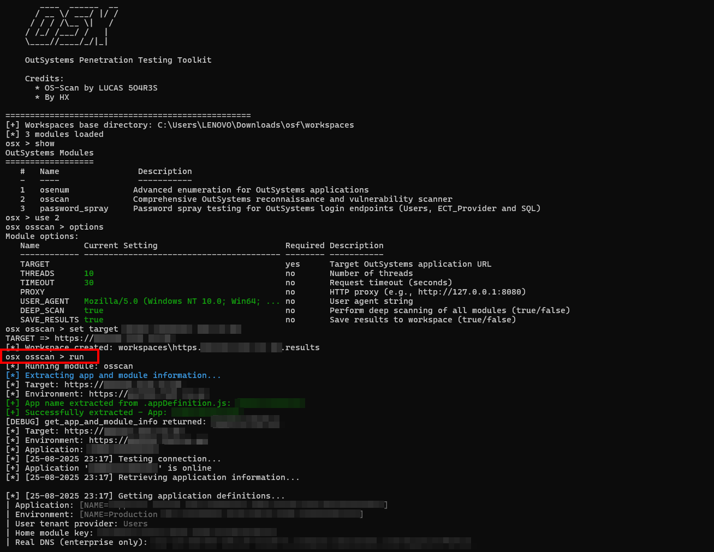

# OutSystems Penetration Testing Toolkit

A toolkit for penetration testing of **OutSystems applications**.  

---

## Modules

| # | Module          | Description                                                                 |
|---|-----------------|-----------------------------------------------------------------------------|
| 1 | `osenum`        | Screens enumeration for OutSystems applications (selenium based)            |
| 2 | `osscan`        | OutSystems reconnaissance and vulnerability scanner (Script By LUCAS 504R3S)|
| 3 | `password_spray`| Password spray testing for OutSystems login endpoints (Users, ECT_Provider, SQL) |

---

## Usage

```bash
# Clone the repository
git clone https://github.com/hx381/osx
cd osx

# Run
python3 osx.py
```

Inside the console:

```bash
osx > show
osx > use osenum
osx (osenum) > options
...
osx (osenum) > run
```

---

## Screenshot (PoC)



---

## TODO / Roadmap

- [ ] Implement SQL Injection testing  
- [ ] Add IDOR (Insecure Direct Object Reference) testing  
- [ ] Implement script to register as a user and use that auth for further testing  
- [ ] Improve module integration & automation  

---

## Contributions

If you encounter issues with your target, some scripts might need tweaking.  
- Open an **issue** with details  
- Or DM me directly on [LinkedIn](https://www.linkedin.com/in/hamza-snoussi-158421189/)

---

## Disclaimer

This project is **for educational and authorized security testing only**.  
Do not use against systems without explicit permission.  

---

## Credits

- OS-Scan by **LUCAS 504R3S**  
- Toolkit by **HX**
